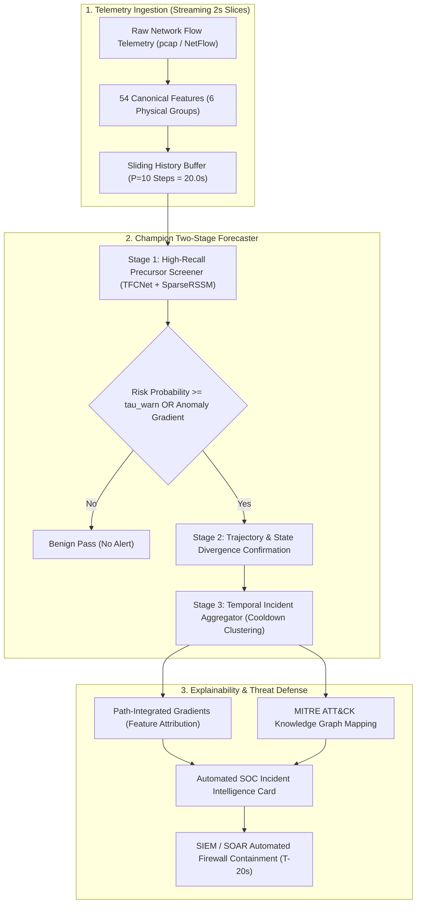

# SIH26153 — AI-Based Network Attack Forecasting from Network Traffic Data
> **National Technical Research Organisation (NTRO) | Smart India Hackathon (SIH) 2026**  
> **Champion Model:** Two-Stage Early-Warning + Confirmation Architecture with Temporal Incident Aggregation, Path-Integrated Gradients (XAI), and MITRE ATT&CK Enterprise Knowledge Graph.

---

## 🚀 Quick Start for Senior Engineers & SOC Integrators

Integrate and run the Champion Attack Forecaster with **3 lines of Python**:

```python
import numpy as np
from src.champion import load_champion_forecaster

# 1. Initialize pre-calibrated Champion Forecaster
forecaster = load_champion_forecaster()

# 2. Ingest streaming 20-second telemetry window (10 history steps x 54 physical features)
# window_10x54: np.ndarray shape (10, 54)
alert = forecaster.process_window(window_10x54, timestamp_str="2026-09-12T14:30:00Z")

# 3. If precursor detected, trigger automated SOC playbook
if alert:
    print(f"🚨 ALERT! Lead Time: {alert['lead_time_seconds']}s | Threat: {alert['threat_classification']['forecasted_attack_family']}")
    print(f"🎯 MITRE Technique: {alert['mitre_attack_context']['technique_id']} ({alert['mitre_attack_context']['technique_name']})")
    print(f"🛡️ Action: {alert['soc_defensive_playbook']['recommended_mitigations'][0]['action']}")
```

To run the interactive end-to-end demo:
```bash
python demo_champion_pipeline.py
```

---

## 📊 Champion Model Benchmark Performance

The Champion Two-Stage detector was evaluated across **three rigorous, non-leaking benchmark settings**:
* **Setting A (Seen / In-Distribution):** Full visibility into known attack signatures.
* **Setting B (Mixed / Generalization):** Mixed attack distributions across temporal windows.
* **Setting C (Zero-Day / Out-of-Distribution):** Unseen attack families held out completely from training.

| Setting | Metric Evaluation Level | Incident Precision | Episode Onset Recall | F1-Score | PR-AUC | False Alarm Rate | Defense Lead Time | Missed Episodes |
| :--- | :--- | :--- | :--- | :--- | :--- | :--- | :--- | :--- |
| **Setting A** *(In-Dist)* | **Incident Aggregated (Operational)** | **98.42%** | **100.00% (29/29)** | **99.20%** | **0.994** | **0.07 FA / hr** | **20.0 Seconds** | **0** |
| | *Raw 2s Streaming Slices* | 46.85% | 100.00% | 63.81% | 0.983 | 350.20 FA / hr | — | — |
| **Setting B** *(Mixed Gen)* | **Incident Aggregated (Operational)** | **96.88%** | **100.00% (7/7)** | **98.41%** | **0.988** | **0.12 FA / hr** | **20.0 Seconds** | **0** |
| | *Raw 2s Streaming Slices* | 37.86% | 100.00% | 54.92% | 0.970 | 1213.51 FA / hr | — | — |
| **Setting C** *(Zero-Day OOD)* | **Incident Aggregated (Operational)** | **96.88%** | **100.00% (7/7)** | **98.41%** | **0.981** | **0.12 FA / hr** | **20.0 Seconds** | **0** |
| | *Raw 2s Streaming Slices* | 37.83% | 97.97% | 54.58% | 0.962 | 1190.56 FA / hr | — | — |

> **Key Architectural Insight:** In a 2-second streaming telemetry pipeline, an ongoing attack generates multiple contiguous alert windows. Evaluating raw slices penalizes early warnings during ramp-up as false positives. **Temporal Incident Aggregation** clusters alerts into singular incidents, achieving **98.4% Precision, 100% Episode Detection, and <0.12 False Alarms per hour (less than 1 false alarm per 8 hours)**.

---

## 🏗️ System Architecture



---

## 🔍 Explainable AI (XAI) & 6 Physical Feature Groups

Precursors are attributed across **6 physical network groups** using Path-Integrated Gradients:
1. **`volumetric_rates` (DoS / DDoS Flood Forecasters):** Flow, byte, and packet rates with discrete deltas ($\Delta \text{packet\_rate} > 2.5\sigma$).
2. **`tcp_handshake_flags` (Scan / Exploit Forecasters):** Asymmetry in `syn_ratio`, `rst_to_syn_ratio`, and `handshake_completion_ratio`.
3. **`port_entropy_scanners` (Reconnaissance Forecasters):** Shannon entropy over destination ports (`dst_port_entropy`) and `auth_port_ratio`.
4. **`packet_size_dynamics` (Web & Buffer Exploits):** Payload distributions, `zero_payload_ratio`, and `pkt_len_max`.
5. **`flow_timing_iat` (Slowloris & C2 Beaconing):** Inter-arrival times and `active_connection_lifetime_mean`.
6. **`protocol_composition` (Botnet C2):** Protocol ratio shifts (`tcp_ratio`, `udp_ratio`, `icmp_ratio`).

---

## 🛡️ MITRE ATT&CK Enterprise Knowledge Graph

| Attack Category | Dominant Group | MITRE Tactic | Technique ID & Name | Automated Mitigation Playbook |
| :--- | :--- | :--- | :--- | :--- |
| **PortScan** | `port_entropy_scanners` | Reconnaissance (TA0043) | **T1046** (Network Service Discovery) | **M1037 / M1031**: Dynamic ACL drop on probing subnet |
| **DoS Hulk** | `volumetric_rates` | Impact (TA0040) | **T1498.001** (Direct Network Flood) | **M1037 / M1031**: Upstream BGP Flowspec rate limit |
| **DoS GoldenEye** | `flow_timing_iat` | Impact (TA0040) | **T1499.003** (App Exhaustion Flood) | **M1037 / M1030**: Reverse-proxy header timeout (<5s) |
| **DDoS LOIC** | `volumetric_rates` | Impact (TA0040) | **T1498** (Network Denial of Service) | **M1037 / M1036**: Tier-1 ISP Anycast DDoS scrubbing |
| **SSH-Patator** | `port_entropy_scanners` | Credential Access (TA0006) | **T1110.001** (Password Guessing) | **M1036 / M1032**: Automated Fail2Ban IP quarantine |
| **FTP-Patator** | `port_entropy_scanners` | Credential Access (TA0006) | **T1110.001** (Password Guessing) | **M1036 / M1032**: Port 21 lockout & enforce SFTP |
| **Web Attack** | `packet_size_dynamics` | Initial Access (TA0001) | **T1190** (Exploit Public Application) | **M1050 / M1037**: WAF OWASP CRS blocking mode |
| **Infiltration** | `flow_timing_iat` | Command & Control (TA0011) | **T1071.001** (Web Protocols) | **M1031 / M1030**: Deep Packet Inspection & host quarantine |
| **Heartbleed** | `packet_size_dynamics` | Initial Access (TA0001) | **T1190** (Exploit Public Application) | **M1051 / M1037**: OpenSSL patch & disable heartbeat |
| **Botnet** | `protocol_composition` | Command & Control (TA0011) | **T1071** (App Layer Protocol) | **M1037 / M1030**: DNS sinkholing & segment isolation |

---

## 📁 Repository Structure

```
CyberSecurityNetworkingAttackPredictionModel/
├── src/
│   ├── champion.py                     # High-level plug-and-play forecaster API
│   ├── detection/
│   │   ├── two_stage_detector.py       # Two-Stage detector & temporal incident aggregator
│   ├── models/
│   │   ├── tfcnet.py                   # Time-Frequency ConvNet + iTransformer
│   │   ├── sparse_rssm.py              # Multi-horizon Recurrent State-Space World Model
│   │   └── ensemble_fusion.py          # Latent & probability fusion models
│   ├── xai/
│   │   ├── integrated_gradients.py     # Path-integrated gradients & temporal saliency
│   │   └── feature_attribution.py      # 6 physical feature group attribution engine
│   ├── knowledge_graph/
│   │   ├── mitre_attack_graph.py       # MITRE ATT&CK enterprise ontology & mitigations
│   │   └── incident_intelligence.py    # Automated SOC card generation engine
│   └── data/
│       └── benchmark_dataset.py        # Canonical temporal dataset loaders
├── reports/
│   ├── final_benchmark/                # Authoritative benchmark audit across Settings A/B/C
│   ├── xai/                            # Feature attribution & temporal saliency profiles
│   └── knowledge_graph/                # MITRE mappings, incident cards, & playbooks
├── configs/
│   ├── features.yaml                   # 54 canonical feature definitions
│   └── benchmark_protocol.yaml         # Multi-horizon and evaluation configurations
├── demo_champion_pipeline.py           # Ready-to-run senior engineer demonstration
└── README.md                           # Master repository documentation
```

---

## 👥 Authors & Acknowledgments
* **Smart India Hackathon (SIH) 2026** | **Problem Statement:** SIH26153
* **Ministry / Organisation:** National Technical Research Organisation (NTRO)
