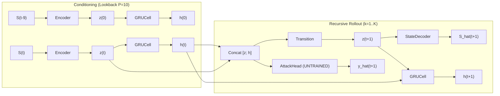

# 09 — Dense Recurrent State-Space Model (RSSM) Audit

## 1. Architectural Specification

- **Source Implementation:** `src/models/sparse_rssm.py` with `sparsity_ratio = 1.0` (Dense control).
- **Input State Dimension:** Exactly 54 dimensions ($S_t \in \mathbb{R}^{54}$).
- **Encoder Architecture:**
  $$	ext{Linear}(54 	o 128) 	o 	ext{LayerNorm}(128) 	o 	ext{GELU} 	o 	ext{Linear}(128 	o 128) 	o 	ext{GELU} 	o 	ext{Linear}(128 	o 128)$$
- **Latent Dimension ($z$):** 128 dimensions (Continuous deterministic vector).
- **Deterministic Recurrent Memory ($h$):** 128 dimensions via `nn.GRUCell(128, 128)`.
- **Stochastic State Dimension:** NONE. (The implementation uses a deterministic state-space model; no Gaussian distributions, no reparameterization $\mu, \sigma$, and no KL divergence loss).
- **Transition Model ($F_	heta$):**
  $$	ext{Linear}(256 	o 128) 	o 	ext{GELU} 	o 	ext{Linear}(128 	o 128)$$
  where input $r_t = [z_t \,;\, h_t] \in \mathbb{R}^{256}$.
- **Shared State Decoder ($D_\psi$):**
  $$	ext{Linear}(128 	o 128) 	o 	ext{GELU} 	o 	ext{Linear}(128 	o 54)$$
- **Forecasting Heads:**
  - `attack_head`: $	ext{Linear}(256 	o 1)$
  - `stage_head`: $	ext{Linear}(256 	o 5)$

## 2. Recursive Autonomous Rollout Formulation

For lookback sequence $X = [S_{t-9}, \dots, S_t]$ and horizon $K$:
1. **Warmup / Conditioning:** For $i = 0 \dots 9$, compute $z_i = 	ext{Encoder}(S_{t-9+i})$, update $h_{i+1} = 	ext{GRUCell}(z_i, h_i)$.
2. **Reconstruction:** $\hat{S}_t = 	ext{StateDecoder}(z_9)$.
3. **Autonomous Recursive Rollout:** For step $k = 1 \dots K$:
   $$r_k = [z_{k-1} \,;\, h_{k-1}]$$
   $$z_k = 	ext{Transition}(r_k)$$
   $$\hat{S}_{t+k} = 	ext{StateDecoder}(z_k)$$
   $$\hat{y}_{t+k} = 	ext{AttackHead}(r_k)$$
   $$h_k = 	ext{GRUCell}(z_k, h_{k-1})$$



## 3. Critical Methodological Flaw: Untrained Attack Head

Inspection of `SparseRSSM.loss()` in `src/models/sparse_rssm.py` (lines 69–75):
```python
def loss(self, out, x: torch.Tensor, targets):
    assert x.shape[-1] == STATE_DIM
    total = nn.functional.mse_loss(out['x_recon'], x)
    state_losses = [nn.functional.mse_loss(p, y) for p, y in zip(out['states'], targets)]
    total = total + sum(state_losses)
    return total, {'recon': float((total - sum(state_losses)).detach()), 'state': sum(state_losses)}
```

> [!CAUTION]
> **CRITICAL FLAW:** `out['attack']` and `out['stage']` are completely omitted from the loss function.
> Consequently, `self.attack_head` and `self.stage_head` receive zero gradient updates and remain at their random Gaussian initializations.
> The reported RSSM attack metrics (F1, Precision, Recall, FPR) are produced by an untrained random projection followed by sigmoid thresholding at 0.5.
