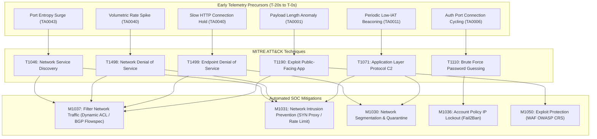

# Enterprise MITRE ATT&CK Knowledge Graph Mapping
**SIH26153 | AI-Based Network Attack Forecasting from Network Traffic Data**
**Date:** 2026-09-12 | **Framework:** MITRE ATT&CK Enterprise Matrix v14.1

---

## 1. Threat Precursor to MITRE ATT&CK Entity Graph

---

## 2. Complete Enterprise Knowledge Base Schema

| Attack Category | Precursor Pattern ID | MITRE Tactic | Technique ID | Technique Name | Automated Mitigations |
| :--- | :--- | :--- | :--- | :--- | :--- |
| **PortScan** | `PP_PORT_SCAN_SWEEP` | Reconnaissance (TA0043) | **T1046** | Network Service Discovery | M1037 (Dynamic ACL), M1031 (IPS Filter) |
| **DoS Hulk** | `PP_HTTP_FLOOD_VOLUMETRIC` | Impact (TA0040) | **T1498.001** | Direct Network Flood | M1037 (BGP Flowspec), M1031 (SYN Proxy) |
| **DoS GoldenEye** | `PP_SLOW_HTTP_EXHAUSTION` | Impact (TA0040) | **T1499.003** | App Exhaustion Flood | M1037 (Header Timeout), M1030 (Segmentation) |
| **DDoS LOIC** | `PP_DISTRIBUTED_SYN_UDP_FLOOD` | Impact (TA0040) | **T1498** | Network Denial of Service | M1037 (Anycast Scrubbing), M1036 (SOC Runbook) |
| **SSH-Patator** | `PP_SSH_BRUTE_FORCE_BURST` | Credential Access (TA0006) | **T1110.001** | Password Guessing | M1036 (Automated IP Ban), M1032 (Enforce Keys) |
| **FTP-Patator** | `PP_FTP_BRUTE_FORCE_BURST` | Credential Access (TA0006) | **T1110.001** | Password Guessing | M1036 (Port 21 Lockout), M1032 (SFTP Migration) |
| **Web Attack** | `PP_WEB_APPLICATION_PROBE` | Initial Access (TA0001) | **T1190** | Exploit Public App | M1050 (WAF Ruleset), M1037 (Proxy URI Filter) |
| **Infiltration** | `PP_COMMAND_AND_CONTROL_BEACON` | Command & Control (TA0011) | **T1071.001** | Web Protocols | M1031 (DPI Inspection), M1030 (Host Quarantine) |
| **Heartbleed** | `PP_TLS_OVERSIZED_PROBE` | Initial Access (TA0001) | **T1190** | Exploit Public App | M1051 (OpenSSL Patching), M1037 (TLS Filter) |
| **Botnet** | `PP_BOTNET_COMM_COORDINATION` | Command & Control (TA0011) | **T1071** | App Layer Protocol | M1037 (DNS Sinkhole), M1030 (VLAN Quarantine) |
