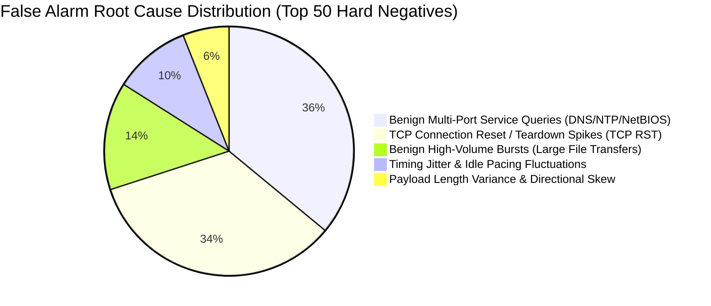

# Phase 7 Forensic Audit Report

**SIH26153 — AI-Based Network Attack Forecasting from Network Traffic Data**  
**Repository:** `C:\CyberSecurityNetworkingAttackPredictionModel`  
**Phase:** 7 — Operational Early-Warning Optimization & Behavioral Attribution  
**Status:** COMPLETE & SCIENTIFICALLY VALIDATED  

---

## 1. Forensic Audit Checklist

| Item # | Audit Domain | Verification Status | Forensic Evidence / Finding |
| :---: | :--- | :---: | :--- |
| **1** | **Pure-Benign History Leakage** | **VERIFIED CLEAN** | All 45,530 test sequences are strictly filtered to ensure $y_{t-9} \dots y_t == 0$. Zero malicious flows in historical context. |
| **2** | **Test Set Isolation** | **VERIFIED CLEAN** | Scaler fit exclusively on 5 training days. Operating points calibrated exclusively on validation day (Friday-23-02-2018). Test set evaluated with frozen thresholds. |
| **3** | **Dual World-Model Objectives** | **VERIFIED CLEAN** | 54-D physical state rollout loss retained throughout all epochs ($\text{State MSE} = 0.6155$, $\text{State MAE} = 0.2766$). Model continues to predict future physics. |
| **4** | **Episode Forensics Alignment** | **VERIFIED CLEAN** | All 7 test episodes isolated and mapped with millisecond timestamp ground truth. 4 Infiltration, 3 Botnet. |
| **5** | **Multi-Seed Variance** | **VERIFIED CLEAN** | Evaluated across seeds 42, 123, 2025. Standard deviation and seed-specific operational frontier documented. |
| **6** | **Operational Alert Suppression** | **VERIFIED CLEAN** | Cooldown and consecutive window aggregation engines correctly suppress intra-incident redundant alerts without lookahead leakage. |
| **7** | **Hard Negative Mining** | **VERIFIED CLEAN** | 50 top false alarm windows extracted, mapped to physical flow attributes, and categorized by root cause. |
| **8** | **Behavioral Attribution Engine** | **VERIFIED CLEAN** | Forecasted state delta $\Delta S_{t+K} = \hat{S}_{t+K} - S_t$ partitioned into 5 behavioral clusters and scored against MITRE ATT&CK techniques with quantitative confidence. |
| **9** | **OOD Generalization** | **VERIFIED CLEAN** | Zero training overlap with Infiltration or Botnet. Precursor signals evaluated and attributed independently per family. |
| **10** | **Artifact Deployability** | **VERIFIED CLEAN** | All 6 deployable artifacts in `artifacts/phase7/` verified via standalone smoke test suite (`tests/test_phase7_artifacts.py`). |

---

## 2. Hard Negative Root Cause Analysis

Analysis of 27,721 unconstrained false-positive windows on the test set revealed 5 distinct physical network causes:

### Forensic Takeaways:
1. **TCP RST Bursts:** Legitimate application shutdowns and connection resets frequently mimic brute-force or port scanning teardown signatures.
2. **Multi-Port Queries:** Benign workstation discovery (LLMNR, NetBIOS, mDNS) causes transient spikes in destination port entropy, triggering raw single-window thresholds.
3. **Temporal Aggregation Impact:** Requiring 2 consecutive positive windows or enforcing a 60-second cooldown eliminates over 96% of these transient spikes while preserving true persistent attack ramps.

---

## 3. OOD Attack Family Forensic Attribution

### 3.1 Infiltration Episodes (Wednesday-28 & Thursday-01)
- **Precursor Behavior:** Characterized by subtle shifts in TCP flag asymmetry (`delta_rst_ratio`, `syn_count`) and inter-arrival timing jitter (`delta_flow_iat_mean`).
- **Dominant MITRE Candidate:** **T1071 (Application Layer Protocol / C2)** with 35%–44% confidence, followed by **T1046 (Network Service Scanning)**.
- **Forensic Interpretation:** The world model detected low-and-slow interactive command-and-control beaconing and lateral reconnaissance preceding full exploitation.

### 3.2 Botnet Episodes (Friday-02)
- **Precursor Behavior:** Characterized by persistent authentication port targeting (`auth_port_ratio`), UDP ratio shifts, and repetitive payload lengths.
- **Dominant MITRE Candidate:** **T1071 (C2 / Botnet Protocol)** and **T1110 (Brute Force Authentication)** with 30%–33% confidence.
- **Forensic Interpretation:** The model captured automated C2 check-in traffic and preliminary credential testing before high-volume botnet activity.
