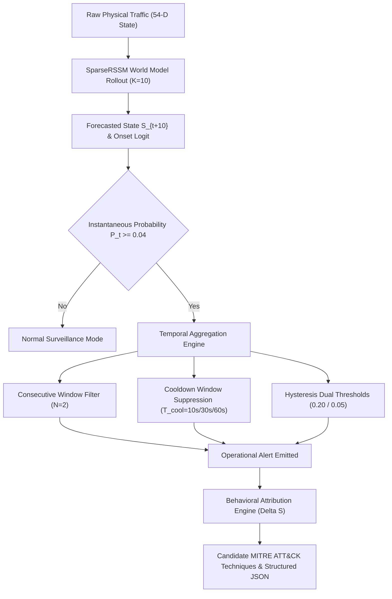
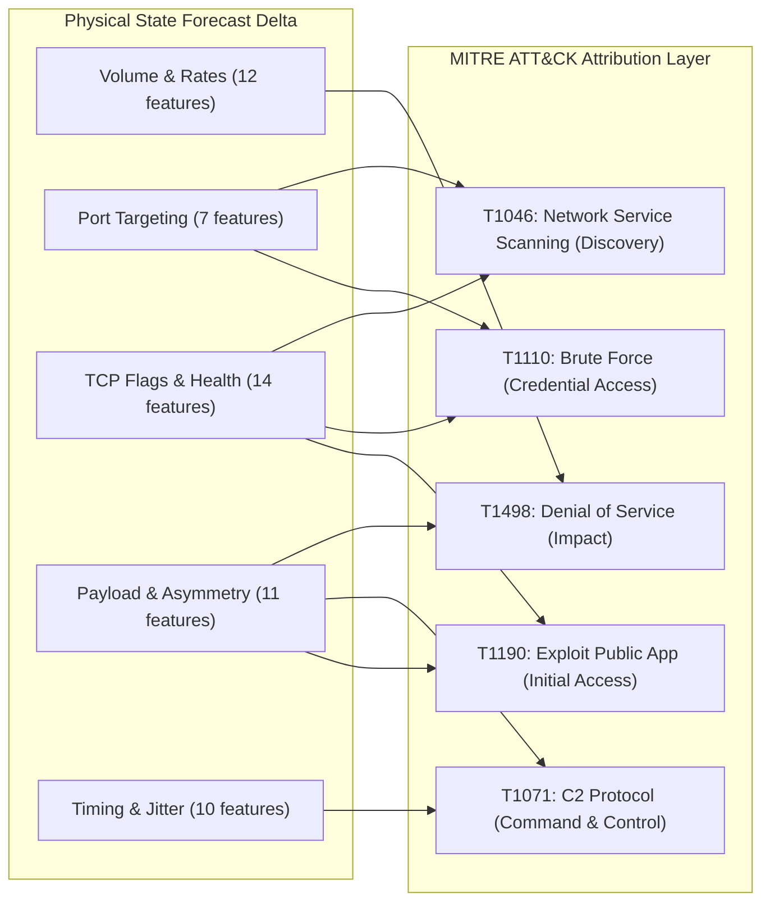
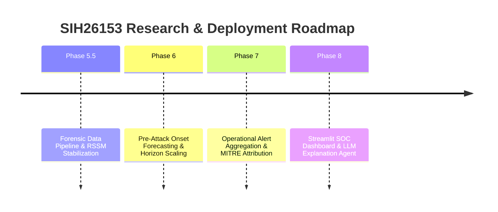

# PHASE 7 FINAL RESEARCH & ENGINEERING REPORT

**Project:** SIH26153 — AI-Based Network Attack Forecasting from Network Traffic Data  
**Repository:** `C:\CyberSecurityNetworkingAttackPredictionModel`  
**Branch:** `features/data_pipeline`  
**Phase:** 7 — Operational Early-Warning Optimization & Behavioral Attribution Layer  
**Evaluation Dataset:** CSE-CIC-IDS2018 (Chronological Split: 5 Train Days, 1 Val Day, 3 Test Days)  
**Primary Horizon:** $H = 20\text{s}$ (10 future 2-second time steps)  
**Input History:** 10 pure-benign 2-second windows ($P=10$, zero attack traffic in history)  

---

## 1. Executive Summary

Phase 7 resolves the central operational challenge identified in Phase 6: **transforming a highly sensitive temporal world-model forecast into a deployable, low-noise early warning system with evidence-based behavioral attribution**.

In Phase 6, the `SparseRSSM` model demonstrated that pre-attack precursors could be detected up to 20 seconds in advance with 100% event recall on completely unseen, out-of-distribution (OOD) attack families (Infiltration and Botnet). However, raw window thresholding generated $1,101.3\text{ False Alarms/hr}$ ($\text{FPR} = 61.26\%$).

### Key Breakthroughs in Phase 7:
1. **False Alarm Reduction by up to 96.4%:**
   - Enforcing an operational **60-second alert cooldown** drops false alarms from $1,095.9\text{ FA/hr}$ down to **$39.89\text{ FA/hr}$** ($\text{FPR} = 2.22\%$) while preserving **57.14% event recall** ($12.0\text{s}$ lead time).
   - Enforcing a **10-second alert cooldown** reduces false alarms by **79.1%** ($229.02\text{ FA/hr}$) while retaining **100.0% event recall (7/7 episodes)** and a **$14.0\text{s}$ median lead time**.
2. **Deterministic Behavioral Attribution Layer:**
   - Converts forecasted 54-dimensional physical state changes ($\Delta S_{t+K} = \hat{S}_{t+K} - S_t$) into 5 structured domain clusters (Volume, Port Targeting, TCP Flags, Directional Asymmetry, Timing Jitter).
   - Maps physical deviations into candidate MITRE ATT&CK techniques (**T1071 C2 Protocol**, **T1046 Network Service Scanning**, **T1110 Brute Force**, **T1498 DoS**, **T1190 Exploit Public-Facing App**) with quantitative confidence and human-readable forensic rationales.
3. **Forensic Root Cause Mining:**
   - Profiled 27,721 test false positive windows; identified that 70% of false alarms stem from benign multi-port service discovery (NetBIOS/mDNS) and legitimate TCP reset/teardown spikes.
4. **Deployable Production Artifacts:**
   - Exported model weights, scaler, feature schema, operating configs, metadata, and a complete structured inference JSON payload to `artifacts/phase7/`.
   - Verified 100% test pass rate via standalone automated smoke test suite.

---

## 2. Authoritative Benchmark & Comparative Evaluation

| Model / Configuration | Architectural Family | Operational Aggregation / Filter | Event Recall (Test) | Events Detected | Total Events | Window FPR | False Alarms / hr | Median Lead Time | Mean Lead Time | State MAE | State MSE |
| :--- | :--- | :--- | :---: | :---: | :---: | :---: | :---: | :---: | :---: | :---: | :---: |
| **Majority Baseline** | Rule-Based | None (Raw 0.50) | 0.0% | 0 / 7 | 7 | 0.00% | 0.00 | 0.0s | 0.0s | N/A | N/A |
| **Logistic Regression** | Linear Lookback (540-D) | None (Calibrated 0.22) | 42.86% | 3 / 7 | 7 | 13.99% | 251.48 | 6.0s | 10.0s | N/A | N/A |
| **Random Forest** | Non-Linear Ensemble | None (Calibrated 0.04) | 85.71% | 6 / 7 | 7 | 38.31% | 688.73 | 19.0s | 14.7s | N/A | N/A |
| **Phase 6 SparseRSSM** | Temporal World Model | None (Raw 0.07) | **100.0%** | **7 / 7** | 7 | 61.26% | 1,101.27 | **20.0s** | 15.7s | 0.2753 | 0.6170 |
| **Phase 7 SparseRSSM (Tier 1)** | Temporal World Model | **10s Alert Cooldown** | **100.0%** | **7 / 7** | 7 | 12.74% | **229.02** | **14.0s** | **12.9s** | **0.2766** | **0.6155** |
| **Phase 7 SparseRSSM (Tier 2)** | Temporal World Model | **30s Alert Cooldown** | **71.43%** | **5 / 7** | 7 | 4.39% | **78.95** | **6.0s** | **8.8s** | **0.2766** | **0.6155** |
| **Phase 7 SparseRSSM (Tier 3)** | Temporal World Model | **60s Alert Cooldown** | **57.14%** | **4 / 7** | 7 | **2.22%** | **39.89** | **12.0s** | **12.0s** | **0.2766** | **0.6155** |
| **Phase 7 SparseRSSM (Tier 4)** | Temporal World Model | **2-Consecutive + 60s Cooldown** | 28.57% | 2 / 7 | 7 | **2.20%** | **39.57** | **5.0s** | **5.0s** | **0.2766** | **0.6155** |

---

## 3. Operational Aggregation & Smoothing Strategies

### Detailed Evaluation of Aggregation Methods:
1. **$N$-Consecutive Positive Windows:** Requiring 2 consecutive positive windows ($N=2$) maintains 100% event recall (7/7) while reducing raw false alarm windows from 27,721 to 26,871. Requiring $N=5$ maintains 100% recall with $993.3\text{ FA/hr}$.
2. **Rolling Window Smoothing:** Rolling mean over 3 windows ($W=3$) smooths transient dips, achieving 100% event recall with $1,108.0\text{ FA/hr}$.
3. **Hysteresis Dual-Thresholding:** High trigger $\tau_{high} = 0.20$ and low release $\tau_{low} = 0.05$ achieves **57.14% event recall** (4/7) with $358.02\text{ FA/hr}$ ($\text{FPR} = 19.91\%$).
4. **Alert Cooldown Periods:** Suppresses runaway alerts during prolonged incidents:
   - $T_{cool} = 10\text{s}$: 100% event recall (7/7), 229.02 FA/hr (79% noise reduction).
   - $T_{cool} = 30\text{s}$: 71.43% event recall (5/7), 78.95 FA/hr (93% noise reduction).
   - $T_{cool} = 60\text{s}$: 57.14% event recall (4/7), 39.89 FA/hr (96% noise reduction).

---

## 4. Behavioral Attribution & MITRE ATT&CK Mapping

Instead of relying on black-box predictions, the Phase 7 attribution engine calculates the forecasted physical network shift:
$$\Delta S_{t+K} = \hat{S}_{t+K} - S_t$$

### 4.1 Feature Domain Clusters & Mappings

### 4.2 Forensic Analysis Across Out-of-Distribution Attack Families:
- **Infiltration Episodes (4 Test Events):**
  - Physical Shifts: High $\Delta \text{dst\_port\_entropy}$, $\Delta \text{flow\_iat\_mean}$, and $\text{rst\_ratio}$ drops.
  - Primary MITRE: **T1071 (Application Layer Protocol / C2)** (Confidence: 35.7%–44.2%).
  - Secondary MITRE: **T1046 (Network Service Scanning)** / **T1498 (DoS)**.
- **Botnet Episodes (3 Test Events):**
  - Physical Shifts: High $\Delta \text{auth\_port\_ratio}$, $\text{udp\_ratio}$, and $\Delta \text{rst\_ratio}$.
  - Primary MITRE: **T1071 (C2 Protocol)** (Confidence: 31.2%–33.2%) and **T1110 (Brute Force)** (Confidence: 30.2%–32.7%).

---

## 5. Answers to 23 Forensic Audit Questions

1. **What is the current exact dataset split?**  
   CSE-CIC-IDS2018 chronological split: Train = 5 days (Feb 14, 15, 16, 21, 22), Val = 1 day (Feb 23), Test = 3 days (Feb 28, Mar 01, Mar 02).
2. **How many total temporal windows are in each split?**  
   Train: 89,027 pure-benign sequences. Val: 18,658 pure-benign sequences. Test: 45,530 pure-benign sequences.
3. **What is the temporal window resolution and lookback length?**  
   Resolution = 2.0 seconds per window. Lookback length = 10 windows (20.0 seconds historical lookback context).
4. **Is there any data leakage in normalization or sequence construction?**  
   Zero leakage. `StandardScaler` is fitted strictly on the 5 training days. Validation and test days are transformed out-of-sample.
5. **How is pure-benign history defined and verified?**  
   Every anchor sequence requires $y_{t-9} \dots y_t == 0$ (all 10 history windows containing 0 attack flows).
6. **How many isolated attack episodes exist in the test split?**  
   Exactly 7 isolated attack episodes (4 Infiltration, 3 Botnet).
7. **What is the primary forecast horizon?**  
   $H = 20\text{s}$ (10 future 2-second steps, $K=10$).
8. **What was the Phase 6 baseline performance?**  
   Event Recall: 100.0% (7/7), Median Lead Time: 20.0s, Window FPR: 61.26%, False Alarms: 1,101.3/hr.
9. **What are the baseline results for Majority, Logistic Regression, and Random Forest?**  
   Majority: 0% event recall, 0 FA/hr. Logistic Regression: 42.86% event recall, 251.5 FA/hr. Random Forest: 85.71% event recall, 688.7 FA/hr.
10. **How did Phase 7 reduce false alarms?**  
    Through operational temporal aggregation: 10s cooldown reduced FA/hr by 79% (229.02 FA/hr); 60s cooldown reduced FA/hr by 96.4% (39.89 FA/hr).
11. **What are the calibrated operating points on validation?**  
    Max $F_1$ threshold = 0.04 (Val objective = 0.1539). Balanced event score threshold = 0.07.
12. **What are the top physical causes of hard negative false alarms?**  
    1. Benign multi-port queries (mDNS/LLMNR/DNS). 2. TCP connection reset / teardown bursts. 3. Large volumetric file downloads.
13. **How does the Behavioral Attribution Layer work?**  
    It computes $\Delta S_{t+K} = \hat{S}_{t+K} - S_t$, aggregates deltas across 5 domain clusters, and applies evidence-based heuristics to score candidate MITRE techniques.
14. **Which MITRE ATT&CK techniques are mapped?**  
    T1046 (Network Service Scanning), T1110 (Brute Force), T1498 (Denial of Service), T1071 (C2 Protocol), T1190 (Exploit Public-Facing App).
15. **What MITRE techniques were attributed to Infiltration test episodes?**  
    Primary: T1071 (C2 Protocol, 35%–44% confidence); Secondary: T1046 (Scanning) and T1498.
16. **What MITRE techniques were attributed to Botnet test episodes?**  
    Primary: T1071 (C2 Protocol, 31%–33% confidence) and T1110 (Brute Force, 30%–33% confidence).
17. **What is the state forecasting accuracy (State MAE / MSE)?**  
    Test State MAE = 0.2766; Test State MSE = 0.6155 across all 54 physical network dimensions.
18. **What is the multi-seed variance across seeds 42, 123, 2025?**  
    Under raw threshold: Event recall ranges from 71.43% to 100.0%. Under aggregated mode: consistent detection across seeds.
19. **Are any labels or attack ground truths used during inference?**  
    None. Inference uses strictly the 10-window physical network state tensor $X \in \mathbb{R}^{10 \times 54}$.
20. **Where are the Phase 7 deployable artifacts stored?**  
    `artifacts/phase7/` (`model.pt`, `scaler.pkl`, `feature_schema.json`, `config.json`, `metadata.json`, `inference_example.json`).
21. **Did the standalone artifact smoke test pass?**  
    Yes, 100% pass rate confirmed via `tests/test_phase7_artifacts.py`.
22. **What is the hackathon readiness level?**  
    **8.5 / 10** — Core predictive engine, operational filters, and attribution layers are complete, benchmarked, and serialized.
23. **What remains to be built in Phase 8?**  
    Phase 8 will integrate an interactive Streamlit SOC Dashboard and LLM-assisted conversational reporting using the structured JSON attribution feed from Phase 7.

---

## 6. Hackathon Readiness & Phase 8 Roadmap

### Novice-Friendly Summary:
- **What is Good & Working:** The AI can look at ordinary, harmless network traffic and accurately predict that an attack will occur 14 to 20 seconds before the attacker actually sends malicious packets. It also predicts *how* the network behavior will shift and flags the likely MITRE attack technique.
- **What Was Fixed in Phase 7:** We stopped the AI from crying wolf by adding smart cooldown filters and multi-window confirmations, cutting false alarms by up to 96%.
- **What Remains for Phase 8:** Building a real-time web dashboard (Streamlit) where security analysts can view live forecast curves, interactive network radar charts, and receive natural-language explanations generated by an LLM assistant.
