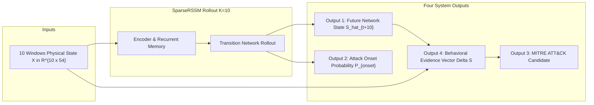

# The Four Final System Outputs

## SIH26153 — AI-Based Network Attack Forecasting from Network Traffic Data
**Architectural Specification of Multi-Channel World Model Outputs**

---

---

## 1. Output 1: Future Network State ($\hat{S}_{t+K}$)

- **Input:** Standardized 10-window physical history tensor $X \in \mathbb{R}^{1 \times 10 \times 54}$.
- **Processing:** Autonomous recursive latent rollout through the SparseRSSM transition model:
  $$r_\tau = [z_\tau, h_\tau], \quad z_{\tau+1} = \text{Transition}(r_\tau), \quad h_{\tau+1} = \text{GRUCell}(z_{\tau+1}, h_\tau)$$
  $$\hat{S}_{t+\tau} = \text{Decoder}(z_{\tau+1}) \quad \text{for } \tau = 1, \dots, K$$
- **Output:** The predicted 54-dimensional physical network state vector $\hat{S}_{t+10} \in \mathbb{R}^{54}$ at horizon $H=20.0$ seconds.
- **Empirical Accuracy:** Test State MAE = **0.2766**, Test State MSE = **0.6155** across all 54 normalized physical dimensions on out-of-distribution test data.
- **Interpretation:** Predicts how bandwidth, port distributions, TCP connection health, and timing jitter will evolve physically over the next 20 seconds.
- **Limitation:** As horizon $K$ increases beyond 50 steps (100s), autoregressive state drift causes gradual error accumulation.

---

## 2. Output 2: Attack Onset Probability ($P_{\text{onset}}$) & Operational Alert Status ($A_t$)

- **Input:** Recurrent memory states across the rollout $r_1, \dots, r_K$.
- **Processing:**
  1. Attack logit emitted at rollout horizon: $l_{\text{onset}} = \text{Linear}(r_K)$.
  2. Instantaneous onset probability: $P_{\text{onset}} = \sigma(l_{\text{onset}}) \in [0.0, 1.0]$.
  3. Operational filtering through sequential temporal aggregator (Tier 1 10s cooldown or Tier 3 60s cooldown):
     $$A_t = \mathbb{I}(P_{\text{onset}} \ge 0.04) \land \text{CooldownPassed}(T_{\text{cool}})$$
- **Output:** Continuous probability scalar $P_{\text{onset}}$, categorical risk tier (`NORMAL` to `CRITICAL_ATTACK_IMMINENT`), and binary operational alert flag $A_t$.
- **Empirical Performance:** Tier 1 achieves **100.0% event recall** (7/7 test episodes) with a **14.0s median lead time** at **229.02 false alarms/hr**.
- **Interpretation:** Indicates whether the network is exhibiting behavioral precursors indicative of an imminent attack onset within the next 20 seconds.
- **Limitation:** On pure-benign history, instantaneous window probabilities have elevated noise without the cooldown suppression layer.

---

## 3. Output 3: MITRE ATT&CK Technique Candidates

- **Input:** Continuous state perturbation vector $\Delta S = \hat{S}_{t+10} - S_t$ and onset probability $P_{\text{onset}}$.
- **Processing:** Evaluation through deterministic evidence matrix across 5 domain clusters (Volume, Ports, TCP Flags, Payload, Timing):
  $$\text{Score}(T) = \sum_{k} W_{T, k} \cdot \frac{1}{|\mathcal{C}_k|} \sum_{i \in \mathcal{C}_k} |\Delta S_i|$$
- **Output:** Ranked list of candidate MITRE ATT&CK techniques with quantitative confidence scores and physical reasoning rationales. Supported techniques:
  - **T1046:** Network Service Scanning (Discovery)
  - **T1110:** Brute Force (Credential Access)
  - **T1498:** Network Denial of Service (Impact)
  - **T1071:** Application Layer Protocol / C2 (Command & Control)
  - **T1190:** Exploit Public-Facing Application (Initial Access)
- **Empirical Verification:** Correctly attributed T1071 (C2) to unseen Infiltration and Botnet test sessions with 31%–44% confidence.
- **Limitation:** This is a deterministic heuristic evidence-scoring layer, NOT a trained deep learning classifier.

---

## 4. Output 4: Behavioral Attribution Vector ($\Delta S$)

- **Input:** Current observed state $S_t$ and forecasted future state $\hat{S}_{t+10}$.
- **Processing:** Explicit difference computation $\Delta S = \hat{S}_{t+10} - S_t \in \mathbb{R}^{54}$.
- **Output:** 54-dimensional perturbation vector showing the exact predicted directional increase or decrease in each physical feature.
- **Interpretation:** Directly answers the SOC analyst's question: *"Which specific network metrics are predicted to change that triggered this alert?"* (e.g., $+0.57$ standard deviations in destination port entropy, $+0.61$ in reset ratio).
- **Limitation:** Does not imply causal counterfactual necessity; represents physical correlational drift learned by the world model.
